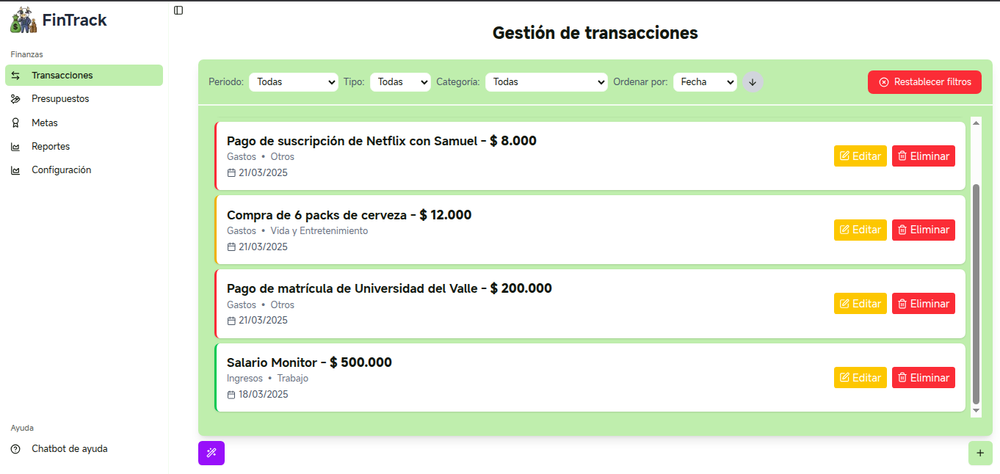

# Fintrack - Rastreador de Finanzas Personales (MVP):

Fintrack es una **aplicación sencilla e intuitiva para el seguimiento financiero** diseñada para ayudar a los usuarios a **registrar y analizar** sus ingresos y gastos de forma eficiente.

## Características:
### Funcionalidades Comunes
* **Transacciones:** Registro y consulta de ingresos y gastos.  
* **Presupuesto:** Configuración y seguimiento de presupuestos.  
* **Meta de Ahorro:** Permite establecer y monitorear objetivos de ahorro personalizados.  
* **Reportes:** Generación de informes financieros.  
* **Configuración:** Permite seleccionar la voz del asistente.  
### Funcionalidades con IA
* **Sugerencias financieras personalizadas:** Recibe recomendaciones diseñadas especialmente para ayudarte a mejorar tu salud financiera. Podrás hacer preguntas a través del chat de voz y obtener respuestas basadas en tus transacciones y objetivos personales.  
* **Registro de transacciones por voz:** Agrega varias transacciones simplemente hablando. Nuestra tecnología entiende lo que dices y registra tus gastos o ingresos de forma rápida y sencilla.  
* **Resumen financiero narrado:** Escucha un resumen en audio de tu estado financiero actual. Ideal para estar al tanto de tu situación económica sin necesidad de leer.  
* **Asistente por voz:** Cuenta con un chat inteligente que te escucha y responde por voz. Puedes hacerle preguntas sobre cómo usar la app o consultar cualquier duda sobre su funcionamiento.

## Tecnologías

- Framework: [Next.js](https://nextjs.org/)
- Jest (pruebas de componentes y pruebas unitarias)
- Base de datos: IndexedDB (integrada en navegador).
- LLM (Modelo de Lenguaje): Gemini
- STT y TTS: ElevenLabs
- Estilo: CSS global y Tailwind
- Linting & Formateo: ESLint + Prettier
- Despliegue: [Render](https://render.com/)


---

## Instalación y configuración

1. Clona el repositorio:

```bash
git clone https://github.com/JuanLoaiza007/fintrack-mvp
cd fintrack-mvp
```

2. Instala dependencias:

```bash
npm install
```

3. Crea un archivo `.env`
Para poder usar **localmente** el modelo necesitas obtener una API key de Gemini. Lo puedes hacer de forma gratuita en [este enlace](https://ai.google.dev/gemini-api/docs/api-key?hl=es-419). Y para obtener la API key de ElevenLabs, acceder a esta [documentación](https://elevenlabs.io/docs/overview). Se ha incluido un archivo `.env.example` que contiene un ejemplo de esto. El contenido del `.env` debería ser:

```bash
NEXT_PUBLIC_GEMINI_API_KEY=tu_gemini_api_key
NEXT_PUBLIC_ELEVENLABS_API_KEY=tu_eleven_labs_api_key
```

Cuando subas tu proyecto clonado a un repositorio de GitHub asegúrate de añadir estas variables de entorno a secrets de GitHub Actions para el pipeline de CI.

4. Ejecuta el entorno de desarrollo:

```bash
npm run dev
```

5. Verifica linting y formateo:

```bash
npm run lint
npm run format
```

---

## Scripts útiles

| Comando          | Descripción                                    |
| ---------------- | ---------------------------------------------- |
| `npm run dev`    | Inicia el entorno de desarrollo (Next.js)      |
| `npm run lint`   | Ejecuta ESLint para revisar errores            |
| `npm run format` | Aplica Prettier para formateo automático       |
| `npm run clean`  | Limpia archivos generados (`.next`, etc.)      |
| `npm run test`   | Placeholder para pruebas unitarias             |

## Desarrolladores:

- **John Freddy Belalcazar Rojas**
- **Juan David Loaiza Santiago**
- **Juan Sebastián Muñoz Rojas**
- **Julián David Rendón Cardona**
- **Nicolás Herrera Marulanda**
- **Samuel Esteiman Galindo Cuevas**
